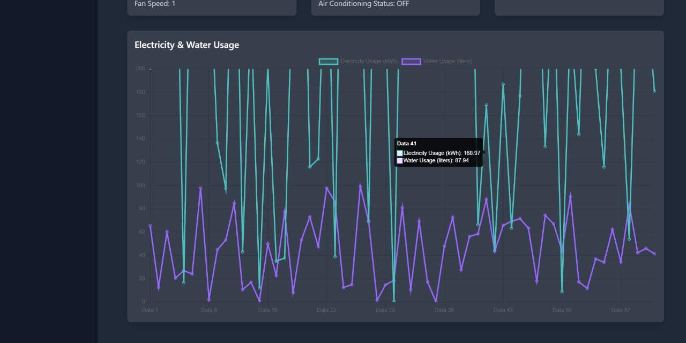

# Digital Twin for RV Vehicle (RVision)


The **RV Vehicle Dashboard and Predictive Maintenance System** provides real-time monitoring, system control, and predictive maintenance features for RV systems and appliances. This project integrates React for the web interface, Supabase for database management, and IoT sensors for future data integration.

## Features

- **Real-Time Monitoring**: Track key RV systems like engine health, HVAC, and appliances.
- **Predictive Maintenance**: View predictions on potential system failures.
- **Historical Data**: Access historical records and maintenance alerts.
- **Remote Control**: Manage RV systems and appliances remotely via the web app.
- **Mobile Alerts**: Receive system maintenance alerts on the mobile app.

## Table of Contents

- [Installation](#installation)
- [Usage](#usage)
- [Features](#features)
- [Technologies](#technologies)
- [Deployment](#deployment)
- [Contributing](#contributing)
- [License](#license)

---

## Installation

### Prerequisites

- Node.js (>= v16.0)
- NPM (>= v7.0)
- Git

### Steps

1. **Clone the Repository:**
   ```bash
   git clone https://github.com/your-repository/rv-dashboard.git
   cd rv-dashboard
   ```

2. **Install Dependencies:**
   ```bash
   npm install
   ```

3. **Start the Application:**
   ```bash
   npm start
   ```

4. **Access the Application:**
   Open [http://localhost:3000](http://localhost:3000) to view it in your browser.

### Live Demo

Visit the live demo at: [Live Web App](https://rvision.vercel.app/)

## Usage

### Login Information

Use the following test credentials to access the app:
- **Email:** zdawrey@gmail.com
- **Password:** 123456

### Key Functionalities

- **Dashboard Overview**: View the current status of all RV systems.
- **Predictive Maintenance**: Stay ahead of potential system failures with predictive analytics.
- **Control Appliances**: Manage HVAC, lighting, and other appliances directly from the web interface.
- **Data Analysis**: Analyze real-time and historical system data for optimization.

### Sidebar Navigation

- **Predictive Maintenance**: Insights into system health and failure predictions.
- **Data Analysis**: Visualize key performance data over time.
- **Historical Data**: Review past system performance, alerts, and actions.
- **Profile**: Manage user settings, notifications, and system configurations.

## Technologies

- **Frontend**: React, Tailwind CSS
- **Backend**: Node.js, Express.js
- **Database**: Supabase (PostgreSQL)
- **APIs**: Custom APIs for data handling and system management
- **Cloud**: Vercel for deployment
- **Version Control**: GitHub

## Deployment

This project is deployed via **Vercel**. The deployment is automated using **GitHub Actions**.

To deploy your own version:
1. Push your changes to your GitHub repository.
2. Connect the repository to Vercel or any preferred deployment platform.
3. Configure the environment variables in Vercel for Supabase integration.

## Screenshots

### Login


### Dashboard



### Predictive Maintainance

### Data Analysis

### Historical Data

### Profile


---
